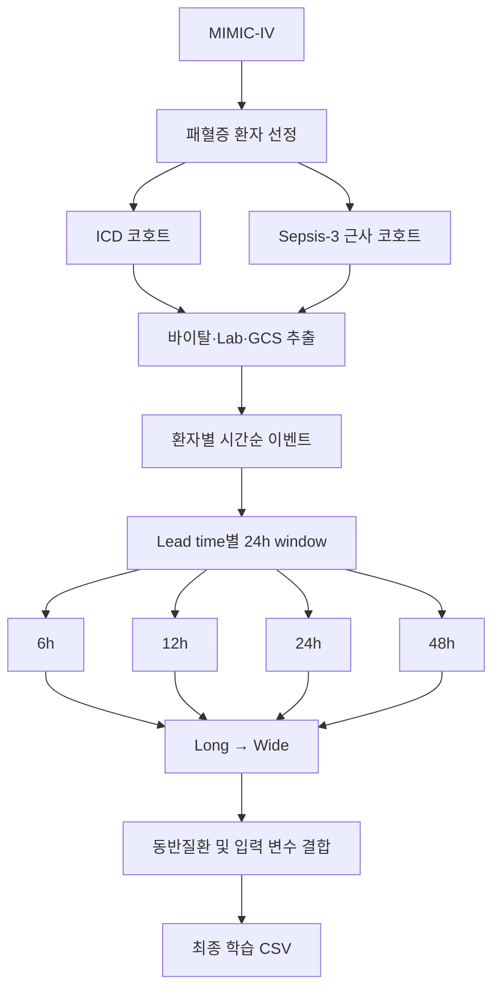
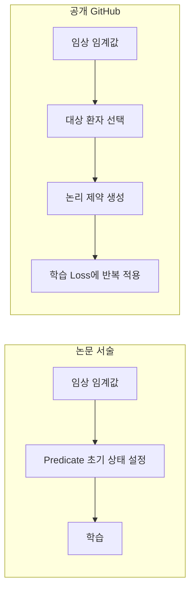

# NeSy-SMP 논문 재현 현황 및 원 논문과의 차이

- 원 논문 코드: [FabrizioDeSantis/NeSy-SMP](https://github.com/FabrizioDeSantis/NeSy-SMP)
- 결과 요약: [`NeSy-SMP/results/RESULTS_SEPSIS3_ALL_LEADS.md`](NeSy-SMP/results/RESULTS_SEPSIS3_ALL_LEADS.md)
- 재현 보고서: [`docs/NeSy-SMP_REPRO_REPORT.md`](docs/NeSy-SMP_REPRO_REPORT.md)

---

## 1. 재현 개요

본 재현에서는 NeSy-SMP의 공개 GitHub 구현을 기반으로 MIMIC-IV 데이터를 이용해 논문의 패혈증 사망 예측 실험을 재현하였다.

다만 공개 저장소에는 **모델 학습 및 평가 코드는 제공되어 있으나, 논문에서 실제 사용한 최종 환자군과 전처리된 학습 데이터는 제공되지 않았다.**

구체적으로 다음 자료가 공개되어 있지 않아 직접 재구축이 필요했다.

* 논문에서 사용한 최종 Sepsis-3 환자 목록
* 동일 환자군을 생성할 수 있는 완성 SQL
* 임상노트에서 추출한 23개 동반질환 데이터
* 6·12·24·48시간 lead time별 최종 학습 CSV

따라서 본 재현은 **공개된 모델 학습 구조와 손실함수는 최대한 유지하되, 데이터 구축 및 일부 학습 설정을 직접 보완한 부분 재현(Partial Reproduction)**에 해당한다.

---

## 2. 논문 · 공개 GitHub · 현재 재현의 차이

| 항목 | 논문 | 공개 GitHub | 현재 재현 |
| --- | --- | --- | --- |
| 원천 데이터 | MIMIC-IV | 미제공 | MIMIC-IV 로컬 DB |
| 패혈증 환자 선정 | Sepsis-3 | 최종 코호트 생성 코드/목록 없음 | ICD 1차 → Sepsis-3 근사 2차 |
| 환자 수 | 약 19,328명 | 미제공 | ICD 약 9,959 / S3 근사 약 18,899 |
| 사망률 | 약 18% | 미제공 | ICD 26.2% / S3 근사 18.6% |
| 관찰 구간 | 24시간 | 완성 CSV 가정 | 직접 생성 |
| Lead time | 6/12/24/48h | 입력 파일 가정 | 직접 생성 |
| 생존자 window | ICU 내 무작위 | 난수 선택 | seed=32 고정 |
| 동반질환 23개 | 임상노트 NLP | 완성 데이터 미제공 | 기본 0 / 추가 ICD proxy |
| 모델 | RF, XGB, BiLSTM, LTN, NeSy-SMP | 구현 제공 | 동일 5종 |
| Data : Knowledge | 0.8 : 0.2 | 0.8 : 0.2 하드코딩 | 동일 |
| Weak anchoring | 임계값 기반 초기화로 서술 | 학습 중 논리 제약으로 적용 | GitHub 구현 사용 |
| BiLSTM checkpoint | 명확하지 않음 | best 저장 후 test 전 reload 없음 | best checkpoint reload |
| LTN / NeSy checkpoint | 명확하지 않음 | best reload | best reload |
| Epoch | 논문 설정 | 기본 약 50 / 20 | 예비실험 30 / 15 |

### 2.1 환자군 선정

가장 큰 차이는 **패혈증 환자군을 구성하는 과정**이다.

초기에는 ICD 진단코드를 이용하여 패혈증 환자를 선정하였다. 그러나 환자 수와 사망률이 논문과 크게 달랐다.

이에 두 번째 재현에서는 **감염 의심과 장기 기능 악화를 함께 고려하는 Sepsis-3 기준에 가깝게 환자군을 재구성**하였다. 환자 수와 사망률은 논문과 상당히 유사해졌다.

> **논문:** 약 19,328명 / 사망률 약 18%  
> **재현:** 약 18,899명 / 사망률 18.6%

다만 논문의 최종 환자 목록 및 완성된 환자 선정 코드가 공개되지 않았기 때문에, 현재 환자군이 논문과 **완전히 동일한 환자 집단이라고 보장할 수는 없다.** 따라서 현재 데이터는 **Sepsis-3 근사 코호트**로 구분한다.

### 2.2 동반질환 23개

논문에서는 임상노트를 자연어 처리하여 **23개 동반질환 정보를 0/1 형태로 추출**하여 모델 입력에 사용한다.

현재 재현에서는 해당 NLP 결과가 제공되지 않아 주요 실험에서 23개 변수를 모두 0으로 설정하였다. ICD 진단코드로 추정한 **ICD proxy**도 6시간 조건에서 비교하였으나 NeSy-SMP 성능에는 큰 변화가 없었다. ICD proxy는 논문의 임상노트 NLP 입력과 동일하지 않다.

### 2.3 학습용 CSV 직접 생성

공개 GitHub 코드는 lead time별 CSV가 이미 있다고 가정한다. 해당 CSV가 공개되지 않아 다음 과정을 직접 구현하였다.

> MIMIC-IV → 환자군 선정 → 임상 이벤트 추출 → 24시간 관찰 구간 생성 → Wide 형태 변환 → 동반질환 결합 → 모델 입력 CSV

사망 환자는 사망 시점에서 각각 6·12·24·48시간을 제외한 뒤 직전 24시간 데이터를 사용하였고, 생존 환자는 ICU 입원 기간 중 가능한 24시간 구간을 선택하였다. 재실행 시 동일 구간을 얻기 위해 난수 seed를 32로 고정하였다.

### 2.4 전처리 및 모델 입력 구조 보완

직접 생성한 CSV와 공개 코드 입력 형식의 차이를 맞추기 위해 다음을 수행하였다.

* 존재하지 않는 검사 및 동반질환 열을 0으로 생성
* 이벤트 범주 관련 입력 오류 방지
* 시계열 입력 최대 길이를 230으로 제한
* Risk MLP 입력 크기를 실제 입력 길이에 맞게 일반화

누락 열을 0으로 채운 방식은 논문의 결측 처리와 동일하다고 확인된 것이 아니다.

### 2.5 Epoch 및 Checkpoint

| 모델 | 공개 GitHub | 현재 재현 |
| --- | --- | --- |
| BiLSTM | 50 epoch | 30 epoch |
| LTN | 20 epoch | 15 epoch |
| NeSy-SMP | 20 epoch | 15 epoch |

공개 코드에서 LTN·NeSy-SMP는 validation 최고 checkpoint를 불러와 test하고, BiLSTM은 best를 저장만 하고 test 전 reload가 없다. 현재 재현에서는 모델 간 조건을 맞추기 위해 **모든 DL 모델에서 validation macro-F1 최고 checkpoint를 reload**하였다.

### 2.6 실험 범위

* **ICD 코호트:** 6시간 Table 1 상세 비교
* **Sepsis-3 근사 코호트:** 6·12·24·48시간 lead time

---

## 3. 유지한 핵심 모델 구조

NeSy-SMP의 핵심 학습 구조는 공개 GitHub 구현을 사용하였다. Data / Knowledge 비율은 공개 코드와 동일하다.

> **Data weight = 0.8**  
> **Knowledge weight = 0.2**

결과 차이는 주로 **환자군 구성 → 동반질환 정보 → 전처리 → Epoch/Checkpoint** 조건에서 발생할 가능성이 있다.

### Weak Anchoring

논문은 임상 임계값으로 predicate를 초기화한다고 서술한다. 공개 GitHub는 임계값 해당 환자에 논리 제약을 두고 **학습 loss에 반복 적용**한다. 현재 재현은 **공개 GitHub 구현**을 사용하였다.

---

## 4. 재현 결과

### 4.1 ICD 코호트 — 6시간 (Table 1 macro)

| 모델 | 논문 Acc | 재현 Acc | 논문 F1 | 재현 F1 | 논문 AUC | 재현 AUC |
| --- | ---: | ---: | ---: | ---: | ---: | ---: |
| RF | 84.78 | 86.28 | 74.77 | 79.85 | 88.11 | 90.28 |
| XGBoost | 85.31 | 87.36 | 77.86 | 82.75 | 88.56 | 91.40 |
| BiLSTM | 83.53 | 86.28 | 76.82 | 81.72 | 85.35 | 89.37 |
| LTN | 85.65 | 85.93 | 79.20 | 81.45 | 88.10 | 89.24 |
| **NeSy-SMP** | **86.45** | **85.95** | **80.35** | **81.54** | **88.33** | **89.15** |

### 4.2 Sepsis-3 근사 — lead time별 NeSy

| Lead time | 재현 NeSy Acc / F1 | 논문 NeSy Acc / F1 |
| ---: | ---: | ---: |
| 6h | **89.64 / 82.54** | 86.45 / 80.35 |
| 12h | **87.86 / 80.41** | 83.94 / 76.32 |
| 24h | **87.06 / 78.22** | 82.93 / 74.71 |
| 48h | **84.26 / 73.54** | 81.95 / 71.05 |

lead time이 길어질수록 성능이 감소하는 경향은 논문과 같다.

### 4.3 Sepsis-3 근사 6h — 모델 간 상대 성능

| 모델 | Accuracy / F1 |
| --- | ---: |
| RF | 89.2 / 78.3 |
| XGBoost | **90.1 / 82.4** |
| BiLSTM | **90.0 / 82.7** |
| LTN | **89.7 / 82.7** |
| NeSy-SMP | **89.6 / 82.5** |

현재 조건에서는 논문에서 보고된 NeSy-SMP의 상대적 우위가 명확히 재현되지 않았다.

### 4.4 Table 1 vs Table 2 (동일 OOF 예측)

| 평가 방식 | NeSy F1 |
| --- | ---: |
| 논문 Table 1 | 80.35 |
| 논문 Table 2 | 68.51 |
| 재현 fold macro 평균 | 81.54 |
| 재현 pooled macro | 81.55 |
| 재현 pooled binary | 72.54 |

Table 1과 Table 2의 F1 차이는 fold 평균 vs pooling보다 **macro vs binary(사망 클래스)** 정의 차이로 상당 부분 설명된다. Table 2 원본 집계 코드는 공개되지 않았다.

---

## 5. 해석 범위와 진행 상태

현재까지 공개 코드 5개 모델을 MIMIC-IV에서 end-to-end로 실행하고, Sepsis-3에 가까운 규모의 환자군으로 6·12·24·48시간 결과를 확인하였다. 다만 논문과 동일하지 않은 코호트·동반질환·전처리·학습 설정이 남아 있어 **exact reproduction이 아닌 부분 재현**이다. 현재 수치만으로 NeSy-SMP의 효과가 없다고 단정하기보다, 아래 조건을 분리 검증할 필요가 있다.

| 항목 | 상태 |
| --- | --- |
| MIMIC-IV 원천 데이터 구축 | 완료 |
| ICD 기반 환자군 구축 | 완료 |
| Sepsis-3 근사 환자군 구축 | 완료 |
| 24시간 관찰 구간·lead time 입력 생성 | 완료 |
| RF / XGBoost / BiLSTM / LTN / NeSy 실행 | 완료 |
| 논문 결과와 1차 비교 | 완료 |
| ICD 기반 동반질환 proxy | 완료 |
| 정확한 Sepsis-3 환자군 재구축 | 추가 검증 필요 |
| 임상노트 기반 동반질환 | 추가 재현 필요 |
| Weak Anchoring 논문/GitHub 비교 | 추가 재현 필요 |
| 원본과 동일 Epoch·Checkpoint 재실행 | 추가 재현 필요 |

---

## 실행 요지

1. 로컬에 `MIMIC4-hosp-icu.db` 준비 (PhysioNet DUA)
2. 코호트: ICD 경로 또는 `build_cohort_sepsis3.py`
3. `build_dataset_gcs.py` → `make_leadtime_csvs.py` → `long_to_wide.py`
4. (선택) `build_comorbidities_icd.py` → `merge_comorbidities.py`
5. `reproduce_tables.py --csv ... --out-dir results --seed 42 --epochs 50 --epochs-nesy 20`

## 라이선스·윤리

MIMIC-IV는 PhysioNet 자격·DUA가 필요합니다. 이 저장소는 **코드와 재현 결과 요약만** 포함하며, 환자 원천 데이터를 배포하지 않습니다.
