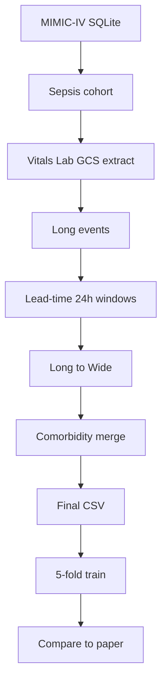
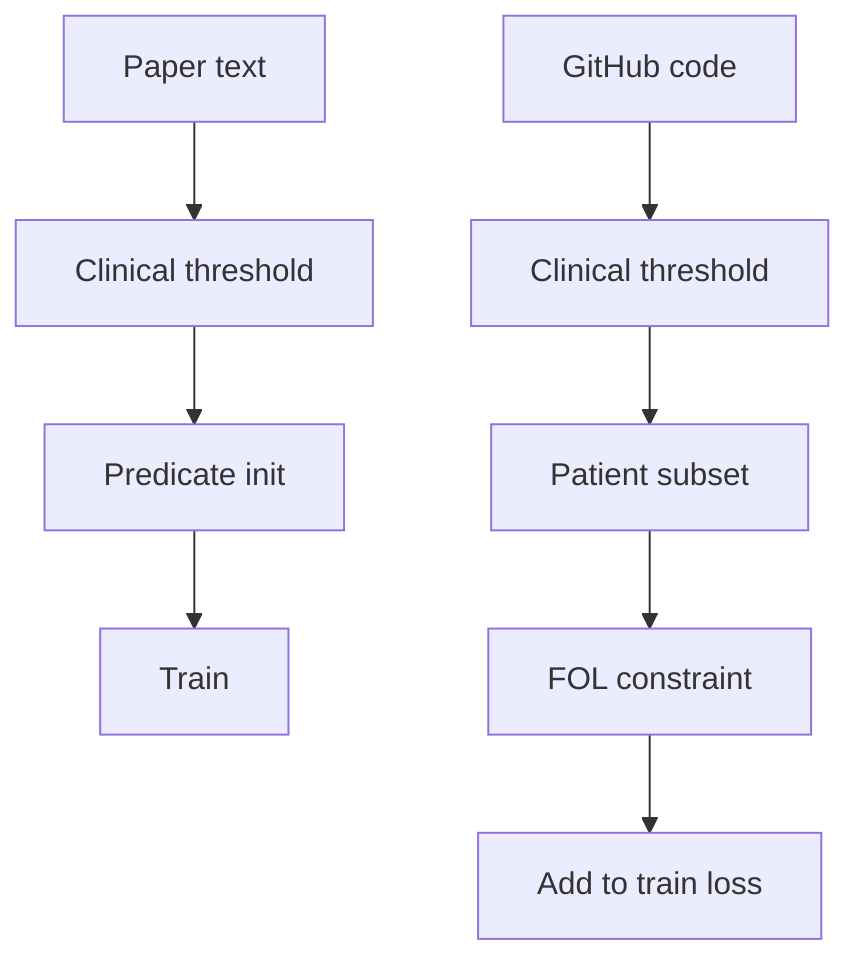

# NeSy-SMP 재현 보고서 (교수님 확인용)

- 저장소: https://github.com/dlwldn4824/NeSy-SMP-repro  
- 원 논문 코드: https://github.com/FabrizioDeSantis/NeSy-SMP  
- 문서 기준일: 2026-08-12  
- 근거: 저장소 코드 및 `NeSy-SMP/results/` 결과 파일 (추측 배제)

---

## 1. 재현 목적 및 범위

공개 NeSy-SMP 학습 코드를 기반으로 MIMIC-IV에서 **end-to-end 재현**을 수행하였다.

공개 GitHub에는 모델·학습 루프는 있으나, 논문에서 사용한 다음 산출물은 제공되지 않는다.

- 최종 Sepsis-3 환자 목록
- 코호트 생성용 완성 SQL
- 6/12/24/48h lead time별 학습 CSV
- 임상노트 NLP로 추출한 23개 동반질환 데이터

따라서 **원천 DB → 입력 CSV → 5-fold 학습·평가** 파이프라인을 직접 재구축한 뒤 공개 모델을 실행하였다.

> **현재 단계는 exact reproduction이 아니라 partial reproduction이다.**  
> (공개 구현 재실행 + 논문·GitHub·재현 조건 차이 식별)

---

## 2. 논문 vs 공개 GitHub vs 현재 재현

| 항목 | 논문 | 공개 GitHub | 현재 재현 |
| --- | --- | --- | --- |
| 원천 데이터 | MIMIC-IV | 미제공 | 로컬 MIMIC-IV SQLite |
| 패혈증 선정 | Sepsis-3 | 최종 코호트/목록 없음 | ICD 1차 → Sepsis-3 **근사** 2차 |
| 환자 수 | 약 19,328 | 미제공 | ICD 약 9,959 / S3 근사 약 18,899 |
| 사망률 | 약 18% | 미제공 | ICD 26.2% / S3 근사 18.6% |
| Observation | 24h | 완성 CSV 가정 | 직접 생성 |
| Lead time | 6/12/24/48h | 입력 파일 가정 | 직접 생성 |
| 생존자 window | ICU 내 무작위 | `np.random` (업스트림 시드 미고정) | `make_leadtime_csvs.py` **seed=32** |
| 동반질환 23개 | 임상노트 NLP | 완성 데이터 미제공 | 주요 실험 **전부 0** / 추가 ICD proxy |
| 결측 | 논문 상세 처리 확인 불가 | 스키마 가정 | 없는 열 생성 후 0 대체 + ffill (코드상) |
| 모델 | RF, XGB, BiLSTM, LTN, NeSy | 구현 제공 | 동일 5종 (`reproduce_tables.py`) |
| Data:Knowledge | 0.8:0.2 | `w_data=0.8`, `w_knowledge=0.2` 하드코딩 | 동일 |
| Weak anchoring | 임계값 **초기화**로 서술 | 임계값 부분집합 + FOL → **train loss** | GitHub 방식 유지 |
| BiLSTM checkpoint | 본문 미명시 | best **save**, test 전 **load 없음** | best val macro-F1 **reload** |
| LTN/NeSy checkpoint | 본문 미명시 | best save + **load** | best reload |
| Epoch | 논문 설정 | `stratified_main.py` 기본 **50 / 20** | 예비 **30 / 15** |
| Table 1 | fold 평균±SD (코드상 macro) | `average="macro"` | fold macro 평균 |
| Table 2 | pooled + bootstrap (binary에 가까움) | 원본 집계 스크립트 미확인 | OOF binary/macro + bootstrap |

---

## 3. 데이터 구축 흐름 (코드 기준)

주요 스크립트:

| 파일 | 역할 |
| --- | --- |
| `data/build_cohort_sepsis3.py` | Sepsis-3 근사 코호트 |
| `data/build_dataset_gcs.py` | 이벤트 추출 |
| `data/make_leadtime_csvs.py` | 6/12/24/48h window (`--seed` 기본 32) |
| `data/long_to_wide.py` | Wide 변환 |
| `data/build_comorbidities_icd.py` / `merge_comorbidities.py` | ICD proxy |
| `reproduce_tables.py` | 학습·Table 1/2 산출 |
| `data/preprocessing.py` | 스키마 정렬, 시퀀스 캡 230 |

---

## 4. ICD 1차 vs Sepsis-3 근사 2차

| 구분 | 환자 수 | 사망률 |
| --- | ---: | ---: |
| 논문 | 약 19,328 | 약 18% |
| ICD 1차 | 약 9,959 | 26.2% |
| Sepsis-3 근사 2차 | 약 18,899 | 18.6% |

Sepsis-3를 **근사**로 표기하는 이유:

1. 논문 최종 환자 목록 미공개  
2. 완성된 코호트 생성 코드 미제공  
3. 공식 MIMIC derived SQL 전체와 동일한 구현이 아님 (`build_cohort_sepsis3.py`는 로컬 SQLite용 근사)

> **[추가 재현 필요]**  
> 공식 MIMIC Code Repository derived SQL / 논문 조건과 정렬한 Sepsis-3 exact reconstruction.

---

## 5. 동반질환

| | 논문 | 현재 재현 |
| --- | --- | --- |
| 출처 | 임상노트 NLP → 23차원 0/1 | 주요 실험: **23차원 전부 0** |
| 추가 실험 | — | ICD diagnosis → 동일 23 label proxy |

두 방식은 **동일하지 않다.** ICD proxy는 노트 NLP의 대체일 뿐 동일 재현이 아니다.

### ICD proxy 6h (Sepsis-3 근사 코호트) — `results_s3_6h_como/table1_summary.csv`

| 모델 | Acc | F1 | AUC |
| --- | ---: | ---: | ---: |
| RF | 89.38 | 78.68 | 92.09 |
| XGBoost | 90.40 | 82.95 | 93.27 |
| BiLSTM | 89.71 | 82.64 | 92.58 |
| LTN | 89.60 | 82.53 | 92.53 |
| NeSy-SMP | 89.59 | 82.28 | 92.49 |

같은 코호트·como=0 (`results/s3_6h`): NeSy Acc/F1 = **89.64 / 82.54**.  
ICD proxy 추가 후 NeSy는 **89.59 / 82.28**로 거의 변화 없음.

> **[추가 재현 필요]**  
> 임상노트 기반 23개 동반질환 구축 후 재학습·비교.

---

## 6. Weak anchoring (중요)

**확인됨 (코드):**

- `stratified_main.py` 약 519–537: Lactate>4 등 threshold로 마스크  
- 약 539–648: `w_data`/`w_knowledge`와 함께 SatAgg → loss  
- weight/bias를 임계값으로 직접 초기화하는 코드는 **확인되지 않음**

**현재 재현:** GitHub loss 제약을 그대로 사용 (`reproduce_tables.py`).

> **[추가 재현 필요]**  
> A) GitHub 구현 · B) 논문 서술형 초기화 · C) anchoring 제거 — 3조건 비교.

---

## 7. Data / Knowledge weight 0.8 / 0.2

**확인됨:**

| 위치 | 내용 |
| --- | --- |
| `stratified_main.py:539-540` | `w_data = 0.8`, `w_knowledge = 0.2` |
| `stratified_main.py:648` | `loss = 1 - (w_data * sat_agg + w_knowledge * sat_agg_knowledge)` |
| `main.py:524-525`, `:629` | 동일 |
| `reproduce_tables.py:198`, `:263` | `w_D, w_K = 0.8, 0.2` → 동일 식 |

**확인 불가:** 0.8/0.2 선택에 대한 체계적 탐색·정당화 (코드/현재 재현 자료에서 근거 없음).

> **[추가 실험 필요]**  
> Knowledge weight sensitivity analysis.

---

## 8. Checkpoint

| 모델 | 공개 `stratified_main.py` | 현재 `reproduce_tables.py` |
| --- | --- | --- |
| BiLSTM | `lstm_best.pth` **save만**, test 전 load **없음** (약 279–290) | best val macro-F1 state **reload** 후 test |
| LTN | best save + `load_state_dict` | best reload |
| NeSy | best save + `load_state_dict` (`ltn_w_k.pth`) | best reload |

BiLSTM 통일은 모델 간 공정 비교를 위한 수정이나, **공개 GitHub 원본과 달라진다.**

> **[추가 재현 필요]**  
> GitHub 원본 BiLSTM checkpoint vs best-reload 통일 조건 비교.

---

## 9. Epoch

| | 공개 `stratified_main.py` CLI 기본 | `main.py` 기본 | 예비 재현 (30/15) | GitHub 정렬 재실행 (50/20) |
| --- | ---: | ---: | ---: | ---: |
| BiLSTM (`num_epochs`) | **50** | 30 | **30** | **50** |
| LTN/NeSy (`num_epochs_nesy`) | **20** | 20 | **15** | **20** |

- 30/15 결과: `results/s3_*h/`, `results/table1_summary.csv` (예비 재현)
- **50/20 결과 (완료, 2026-08-13):** `results/ep50_20/` + [`RESULTS_EP50_20.md`](../NeSy-SMP/results/ep50_20/RESULTS_EP50_20.md)
- S3 6/12/24/48h + ICD 6h, seed=42, best val macro-F1 reload, como=0

**50/20 vs 30/15:** DL F1 변화 대체로 ±0.5%p 이내. NeSy 상대 우위 부재 결론 변화 없음.

---

## 10. Table 1 / Table 2

**확인됨 (`reproduce_tables.py`):**

- Table 1: fold별 `metric_bundle(..., average="macro")` → mean±std  
- Table 2: OOF 합친 뒤 binary/macro point + bootstrap 1000

논문 NeSy 6h (보고값):

| | F1 |
| --- | ---: |
| Table 1 | 80.35 |
| Table 2 | 68.51 |

현재 ICD 6h 동일 OOF (`results/` 문서화 수치):

| 집계 | F1 |
| --- | ---: |
| fold macro mean | 81.54 |
| pooled macro | 81.55 |
| pooled binary | 72.54 |

→ fold vs pool보다 **macro vs binary** 차이가 큼.  
단, 논문 Table 2 **원본 집계 코드는 미공개**이므로 동일 방식이라고 **확정하지 않음**.

---

## 11. 성능 결과

### 11.1 ICD 6h — Table 1 macro (`results/table1_summary.csv`)

| 모델 | Acc 논문 | Acc 재현 | F1 논문 | F1 재현 | AUC 논문 | AUC 재현 |
| --- | ---: | ---: | ---: | ---: | ---: | ---: |
| RF | 84.78 | 86.28 | 74.77 | 79.85 | 88.11 | 90.28 |
| XGBoost | 85.31 | 87.36 | 77.86 | 82.75 | 88.56 | 91.40 |
| BiLSTM | 83.53 | 86.28 | 76.82 | 81.72 | 85.35 | 89.37 |
| LTN | 85.65 | 85.93 | 79.20 | 81.45 | 88.10 | 89.24 |
| NeSy-SMP | 86.45 | 85.95 | 80.35 | 81.54 | 88.33 | 89.15 |

코호트·사망률이 논문과 달라 절대 비교에 한계.

### 11.2 Sepsis-3 근사 — NeSy 전체 lead (`results/RESULTS_SEPSIS3_ALL_LEADS.md`, como=0)

| Lead | 재현 Acc / F1 | 논문 Acc / F1 |
| ---: | ---: | ---: |
| 6h | 89.64 / 82.54 | 86.45 / 80.35 |
| 12h | 87.86 / 80.41 | 83.94 / 76.32 |
| 24h | 87.06 / 78.22 | 82.93 / 74.71 |
| 48h | 84.26 / 73.54 | 81.95 / 71.05 |

Lead ↑ → 성능 ↓ 경향은 논문과 일치. 절대값은 재현이 높음.

### 11.3 Sepsis-3 근사 6h 상대 성능 (como=0)

| 모델 | Acc / F1 |
| --- | ---: |
| RF | 89.17 / 78.27 |
| XGBoost | **90.13 / 82.36** |
| BiLSTM | 89.96 / 82.66 |
| LTN | 89.70 / 82.70 |
| NeSy-SMP | 89.64 / 82.54 |

논문에서 보고된 NeSy 우위가 현재 조건에서는 **명확히 재현되지 않음**.

### 11.4 Epoch 50/20 재실행 (`results/ep50_20/`, 2026-08-13)

| Lead | NeSy F1 (50/20) | NeSy F1 (30/15) |
| ---: | ---: | ---: |
| 6h | 82.88 | 82.54 |
| 12h | 80.58 | 80.41 |
| 24h | 78.14 | 78.22 |
| 48h | 74.32 | 73.54 |

전 lead·ICD 6h 포함 5개 job 완료. epoch를 GitHub 기본으로 올려도 해석 변화 없음.

---

## 12. NeSy 우위가 약하게 나타난 점에 대한 해석

단정하지 않음. **가능한 원인:**

1. 임상노트 comorbidity 미재현 (전부 0 / ICD proxy ≠ 논문)  
2. Sepsis-3 cohort 미완전 일치  
3. Weak anchoring 논문 서술 ≠ GitHub 구현  
4. 결측·0 대체 처리 차이  
5. ~~Epoch 단축 (30/15)~~ → **50/20 재실행으로 배제** (F1 ±0.5%p 이내)  
6. BiLSTM checkpoint 수정  
7. 현재 정형 입력에서 XGBoost 등이 강할 가능성  

> 현재 결과만으로 Neuro-Symbolic 방법의 효과가 없다고 판단할 수 없다.  
> NeSy 추가 성능이 어떤 knowledge component에서 발생하는지 **ablation**이 필요하다.

---

## 13. 코드 audit 요약

| # | 항목 | 상태 |
| --- | --- | --- |
| 1 | survivor seed=32 | **확인됨** `make_leadtime_csvs.py` `--seed` default=32, `default_rng(seed)` |
| 2 | sequence 최대 230 | **확인됨** `preprocessing.py` `FIXED_WINDOW = 230` |
| 3 | 공개 코드 요구 feature | **확인됨** preprocess 선택 열: numeric 27 + como 23 + cat 4 (+ hadm/label) |
| 4–5 | 누락/0 생성 열 | **부분 확인** (아래). 전수 audit는 추가 필요 |
| 6 | 변수별 missing rate | **부분 확인** (S3 6h wide 샘플 20만 행) |
| 7–8 | w=0.8/0.2, loss 식 | **확인됨** (§7) |
| 9 | weak anchoring 위치 | **확인됨** `stratified_main.py` 약 519–648 |
| 10–12 | checkpoint 흐름 | **확인됨** (§8) |
| 13–14 | epoch | **확인됨** (§9) |
| 15–16 | T1/T2 averaging | **확인됨** (§10). 논문 T2 원본 코드는 **확인 불가** |

### 결측·0 열 (S3 6h wide, 환자 단위 non-zero rate 샘플)

샘플에서 **전 환자 0**에 가깝게 나온 요구 열 예:

- Arterial CO2 Pressure, Daily Weight, BNP, Direct Bilirubin, Creatinine (whole blood)

(추출 맵 `long_to_wide.CONCEPT_MAP`에 없거나 이벤트 미추출로 스키마 맞추기용 0 열일 가능성.)

Comorbidity(병합 전 wide): any nonzero **0%** (의도된 como=0 실험).

> **[추가 audit 필요]**  
> 전체 CSV 기준 변수·환자 결측률 전수, 논문 결측 처리와의 정렬.

> **[추가 검증 필요]**  
> survivor window seed sensitivity (32 외 다수 seed).

---

## 14. 추가 재현 필요 항목 (체크리스트)

> **[추가 재현 필요]** — Sepsis-3 exact reconstruction (공식 derived SQL 정렬)

> **[추가 재현 필요]** — clinical-note comorbidities 23

> **[추가 재현 필요]** — weak anchoring: paper vs GitHub vs 제거

> ~~**[추가 재현 필요]** — epoch / early stopping을 공개·논문 조건에 맞춤~~ → **완료** (`results/ep50_20/`)

> **[추가 재현 필요]** — BiLSTM checkpoint 원본 vs best-reload

> **[추가 audit 필요]** — missing-value / 0-fill 전수

> **[추가 검증 필요]** — survivor window seed sensitivity

> **[추가 실험 필요]** — knowledge weight sensitivity (0.8:0.2)

---

## 15. 결론

공개 NeSy-SMP 구현을 MIMIC-IV 원천 데이터부터 **실제 실행 가능한 형태로 재구축**하였고, 논문·GitHub·현재 재현 사이의 주요 차이(코호트, comorbidity, weak anchoring, checkpoint, epoch, 결측)를 식별하였다.

절대 성능만으로 논문의 NeSy 우위를 검증했다고 보기 어렵다. 다음 단계는 차이를 **하나씩 제거·분리**하는 ablation이다.
