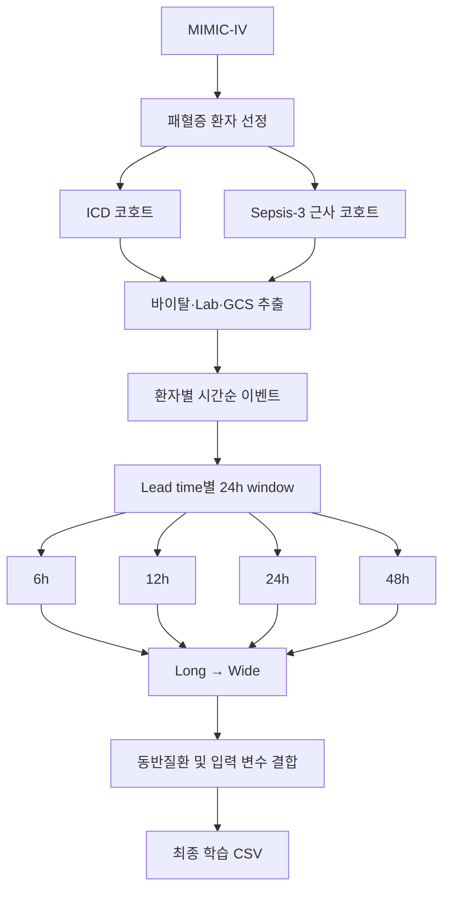
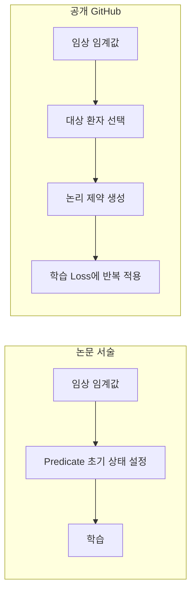
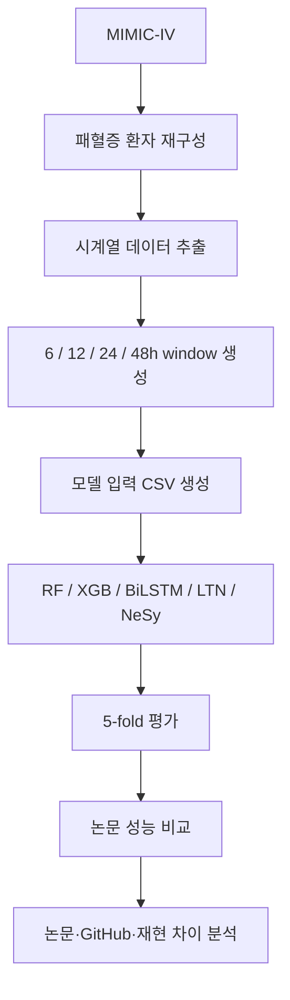

# NeSy-SMP 재현 및 논문·공개 구현 비교

## 1. 재현 목적

NeSy-SMP 논문의 결과를 공개 GitHub 코드와 MIMIC-IV를 이용해 재현하였다.

다만 공개 저장소에는 모델 및 학습 코드는 포함되어 있지만, 논문에서 실제 사용한 다음 데이터는 제공되지 않는다.

* 최종 Sepsis-3 환자 목록
* 코호트 생성용 완성 SQL
* 6/12/24/48시간 lead time별 학습 CSV
* 임상노트에서 추출한 23개 동반질환 데이터

따라서 이번 재현에서는 **MIMIC-IV 원천 데이터에서 모델 입력 데이터까지 직접 재구축**한 뒤 공개 모델을 실행하였다.

현재 결과는 논문의 실험 조건을 완전히 동일하게 복원한 exact reproduction이 아니라,

> **공개 코드 기반 end-to-end 재현 + 논문·GitHub 구현 차이 분석**

단계이다.

- 원 논문 코드: [FabrizioDeSantis/NeSy-SMP](https://github.com/FabrizioDeSantis/NeSy-SMP)
- 결과 요약: [`NeSy-SMP/results/RESULTS_SEPSIS3_ALL_LEADS.md`](NeSy-SMP/results/RESULTS_SEPSIS3_ALL_LEADS.md)

---

# 2. 논문 · 공개 GitHub · 현재 재현의 차이

| 항목 | 논문 | 공개 GitHub | 현재 재현 |
| --- | --- | --- | --- |
| 원천 데이터 | MIMIC-IV | 미제공 | MIMIC-IV 로컬 DB |
| 패혈증 환자 선정 | Sepsis-3 | 최종 코호트 생성 코드/목록 없음 | ICD 1차 → Sepsis-3 근사 2차 |
| 환자 수 | 약 19,328명 | 미제공 | ICD 약 9,959 / S3 근사 약 18,899 |
| 사망률 | 약 18% | 미제공 | ICD 26.2% / S3 근사 18.6% |
| 관찰 구간 | 24시간 | 완성 CSV 가정 | 직접 생성 |
| Lead time | 6/12/24/48h | 입력 파일 가정 | 직접 생성 |
| 생존자 window | ICU 내 무작위 | 난수 선택 | seed=32 고정 |
| 동반질환 23개 | 임상노트 NLP | 완성 데이터 미제공 | 기본 0 / 추가 ICD proxy |
| 모델 | RF, XGB, BiLSTM, LTN, NeSy-SMP | 구현 제공 | 동일 5종 |
| Data : Knowledge | 0.8 : 0.2 | 0.8 : 0.2 하드코딩 | 동일 |
| Weak anchoring | 임계값 기반 초기화로 서술 | 학습 중 논리 제약으로 적용 | GitHub 구현 사용 |
| BiLSTM checkpoint | 명확하지 않음 | best 저장 후 test 전 reload 없음 | best checkpoint reload |
| LTN / NeSy checkpoint | 명확하지 않음 | best reload | best reload |
| Epoch | 논문 설정 | 기본 약 50 / 20 | 예비 30/15 + **50/20 재실행 완료** (`results/ep50_20/`) |

---

# 3. 데이터 재구축

## 3.1 1차: ICD 기반 패혈증 환자 선정

초기에는 MIMIC-IV의 패혈증 ICD 진단코드를 이용해 환자를 선정하였다.

결과:

* 환자 약 **9,959명**
* 사망률 **26.2%**

논문의 약 19,328명 / 사망률 약 18%와 큰 차이가 나타났다.

따라서 ICD 기반 환자 선정만으로는 논문의 코호트를 재현하기 어렵다고 판단하였다.

---

## 3.2 2차: Sepsis-3 근사 코호트 구축

논문의 환자 선정 조건에 가까워지기 위해 다음 정보를 이용하여 Sepsis-3를 근사하였다.

* 항생제 투여
* 배양검사
* SOFA 관련 장기 기능 정보

결과:

* 환자 약 **18,899명**
* 사망률 **18.6%**

으로 논문의 약 19,328명 / 약 18%에 상당히 가까워졌다.

다만 이는 논문 저자가 사용한 최종 환자 목록이나 공식 전처리 코드를 그대로 사용한 것이 아니므로 **Sepsis-3 근사 코호트**로 구분한다.

### 추가 재현 필요

현재 코호트는 규모와 사망률은 논문에 가까워졌지만 동일 환자 집단임을 보장할 수 없다.

최종 비교에서는 MIMIC 공식 derived SQL 및 Sepsis-3 구현과 최대한 동일하게 코호트를 다시 생성할 필요가 있다.

---

# 4. 입력 데이터 생성

선정된 환자에 대해 MIMIC-IV에서 다음 시계열 정보를 추출하였다.

* 바이탈
* 혈액검사
* 젖산
* GCS
* 기타 공개 코드에서 요구하는 임상 변수

사망 환자는

> `사망 시각 - lead time`

을 기준으로 그 직전 24시간 데이터를 사용하였다.

생존 환자는 ICU 체류 기간에서 24시간 구간을 무작위 선택하였다.



생존자의 무작위 window는 재실행 시 동일한 데이터를 얻기 위해 `seed=32`로 고정하였다.

`32` 자체에 특별한 통계적 의미가 있는 것은 아니며, 현재 기록상 해당 숫자를 선택한 별도 근거는 확인되지 않는다. 핵심 목적은 **난수 고정을 통한 재현성 확보**이다.

### 추가 검증 필요

생존자의 특정 무작위 window가 결과에 영향을 줄 수 있으므로, 향후 여러 seed에서 데이터를 다시 생성하여 성능 변동을 확인할 필요가 있다.

---

# 5. 동반질환 처리

논문에서는 임상노트를 자연어 처리하여 환자별 23개 동반질환을 0/1 벡터로 구성한다.

예를 들어 한 환자의 입력은 실제로 다음과 같은 형태가 되어야 한다.

```text
[0, 1, 0, 0, 1, ..., 0]
```

즉 각 위치가 특정 동반질환의 존재 여부를 나타낸다.

하지만 현재 재현에서는 논문과 동일한 임상노트 기반 결과를 확보하지 못했다.

따라서 주요 실험에서는 23개 항목을 모두 0으로 입력하였다.

```text
[0, 0, 0, ..., 0]
```

이는 논문의 입력 조건과 명확하게 다르다.

후속 실험에서는 ICD 진단코드를 이용해 같은 환자가 가지고 있는 기존 질환을 23개 동반질환과 대응시켜 **ICD 기반 proxy**를 생성하였다.


6시간 조건에서 ICD proxy를 추가했을 때 NeSy-SMP 성능은 거의 변하지 않았다.

| 조건 | NeSy-SMP Accuracy / F1 |
| --- | ---: |
| Sepsis-3 근사 + comorbidity 0 | 89.6 / 82.5 |
| Sepsis-3 근사 + ICD proxy | 89.6 / 82.3 |

따라서 **ICD 기반 대체 정보만으로는 NeSy 성능 향상이 관찰되지 않았다.**

단, 논문은 임상노트 NLP를 사용했으므로 이 결과만으로 동반질환 정보 자체의 효과가 없다고 판단할 수 없다.

### 추가 재현 필요

논문과 동일하거나 최대한 유사한 임상노트 기반 23개 동반질환을 구축한 후 재학습이 필요하다.

---

# 6. 결측 입력 처리

공개 학습 코드가 요구하는 입력 스키마와 직접 생성한 데이터의 열 구성이 완전히 일치하지 않는 경우, 필요한 열을 생성하여 0으로 보완하였다.

이 처리는 모델을 실행하기 위한 입력 구조를 맞추는 데에는 필요했지만, 논문의 실제 결측 처리 방법과 동일하다고 볼 수 없다.

특히

> 실제 값이 0인 경우와 측정되지 않아 0으로 입력한 경우

가 모델 입장에서 동일하게 보일 가능성이 있다.

현재 결과 문서에는

* 전체 요구 변수 수
* 완전히 누락된 열 수
* 변수별 결측률

이 정리되어 있지 않다.

### 추가 검증 필요

최종 결과 전에 다음을 별도로 audit해야 한다.

1. 공개 코드가 요구하는 전체 변수
2. 실제 추출된 변수
3. 전체가 누락된 변수
4. 변수별·환자별 결측률
5. 논문의 결측 처리와 현재 0 대체 방식의 차이

따라서 현재 0 대체는 **재현을 위한 임시 처리**로 보는 것이 적절하다.

---

# 7. 공개 코드의 NeSy 학습 방식

공개 코드에서는 데이터 기반 만족도와 의료 지식 기반 만족도를 다음 비율로 결합한다.

```python
w_data = 0.8
w_knowledge = 0.2
```

따라서 최종 최적화는 개념적으로

```text
0.8 × 데이터 기반 학습
+
0.2 × 의료 논리 규칙 만족
```

구조이다.

이 비율은 현재 재현에서도 그대로 유지하였다.

다만 공개 코드에서 `0.8 / 0.2`가 고정되어 있다는 것은 확인되지만, 이 비율이 체계적인 탐색을 통해 최적값으로 결정되었는지는 현재 재현 자료만으로 확인되지 않았다.

### 추가 실험 필요

Knowledge weight를 변화시키는 sensitivity analysis를 통해

> NeSy 성능이 0.8/0.2 설정에 얼마나 의존하는가

를 확인할 필요가 있다.

---

# 8. 논문과 GitHub의 Weak Anchoring 불일치

이번 재현에서 중요한 차이 중 하나이다.

논문에서는 weak anchoring을 임상 임계값에 따라 predicate의 초기 상태를 설정하는 방식으로 서술한다.

반면 공개 GitHub에서는 임상 임계값에 해당하는 환자 집합에 대해 논리 제약을 만들고 이를 **학습 loss에 지속적으로 추가**한다.



현재 재현에서는 **논문 문장을 새로 구현하지 않고 공개 GitHub 방식을 그대로 사용**하였다.

따라서 현재 결과는 논문의 weak anchoring 자체를 완전히 재현한 결과가 아니라

> **저자가 공개한 구현을 재현한 결과**

이다.

### 핵심 추가 재현 필요

최종적으로는 다음 세 조건을 비교하는 것이 필요하다.

```text
A. GitHub 공개 구현
B. 논문 서술에 맞춰 구현한 weak anchoring
C. weak anchoring 제거
```

이를 통해 논문과 코드의 구현 차이가 실제 성능에 영향을 주는지 확인할 수 있다.

---

# 9. Checkpoint 차이

공개 GitHub에서는 모델별 최종 평가 방식에도 차이가 있다.

* **LTN / NeSy-SMP:** validation 성능이 가장 좋은 checkpoint를 저장한 뒤 다시 불러와 test
* **BiLSTM:** best checkpoint를 저장하지만 test 직전에 다시 불러오는 과정이 없음

현재 재현에서는 모델 간 평가 조건을 맞추기 위해 BiLSTM도 best validation macro-F1 checkpoint를 다시 불러와 평가하였다.

이는 모델 간 공정 비교를 위한 수정이지만 **공개 GitHub를 그대로 실행한 결과는 아니다.**

따라서 현재 결과와 함께 원본 구현도 확인할 필요가 있다.

### 추가 재현 필요

```text
조건 A
GitHub 원본 BiLSTM checkpoint 방식

조건 B
Best checkpoint로 통일한 방식
```

을 별도로 비교하여 checkpoint 차이가 결과에 미치는 영향을 확인한다.

---

# 10. Epoch 차이

현재 초기 재현에서는 계산 비용을 줄여 전체 파이프라인을 우선 검증하기 위해

* BiLSTM: **30 epoch**
* LTN / NeSy-SMP: **15 epoch**

으로 실행하였다.

공개 코드의 기본 설정은 이보다 길다.

따라서 현재 성능은 **예비 재현 결과**로 보는 것이 적절하며, 논문의 최종 수치와 직접 비교하기 위해서는 학습 조건을 다시 맞춰야 한다.

### 재실행 예정

최종 비교에서는

* epoch
* early stopping
* validation 기준
* checkpoint 선택

을 논문 및 공개 코드 조건과 최대한 동일하게 맞춰 다시 학습한다.

---

# 11. 평가 방식 재현

논문의 Table 1과 Table 2는 동일한 모델 결과를 서로 다른 방식으로 집계한 것으로 보인다.

### Table 1

5-fold별 성능을 계산한 후 평균과 표준편차를 보고하며, F1은 공개 코드 흐름상 macro F1이다.

### Table 2

각 fold의 test 예측을 모두 모은 뒤 성능과 통계 구간을 계산한다.

논문의 NeSy-SMP 6시간 F1은

| 평가 | F1 |
| --- | ---: |
| Table 1 | 80.35 |
| Table 2 | 68.51 |

로 큰 차이가 있다.

이를 확인하기 위해 현재 재현의 동일한 fold test 예측을 모아 평가하였다.

| 평가 방식 | F1 |
| --- | ---: |
| Fold macro 평균 | **81.54** |
| 전체 test 예측 pooled macro | **81.55** |
| 전체 test 예측 binary F1 | **72.54** |

Fold 평균과 pooled macro는 거의 동일했지만 binary F1에서 큰 감소가 나타났다.

따라서 논문의 Table 1과 Table 2 사이 F1 차이는 단순 pooling 여부보다는

> **macro F1과 사망 클래스 중심 binary F1의 차이**

로 상당 부분 설명될 가능성이 있다.

다만 Table 2의 원본 집계 코드가 공개되지 않았으므로 동일 방식이라고 확정하지 않는다.

---

# 12. 재현 결과

## 12.1 1차 ICD 코호트 — 6시간

| 모델 | 논문 Acc | 재현 Acc | 논문 F1 | 재현 F1 | 논문 AUC | 재현 AUC |
| --- | ---: | ---: | ---: | ---: | ---: | ---: |
| RF | 84.78 | 86.28 | 74.77 | 79.85 | 88.11 | 90.28 |
| XGBoost | 85.31 | 87.36 | 77.86 | 82.75 | 88.56 | 91.40 |
| BiLSTM | 83.53 | 86.28 | 76.82 | 81.72 | 85.35 | 89.37 |
| LTN | 85.65 | 85.93 | 79.20 | 81.45 | 88.10 | 89.24 |
| **NeSy-SMP** | **86.45** | **85.95** | **80.35** | **81.54** | **88.33** | **89.15** |

ICD 코호트의 환자 구성과 사망률이 논문과 크게 다르므로 절대 성능 비교에는 한계가 있다.

---

## 12.2 Sepsis-3 근사 코호트 — 전체 lead time

| Lead time | 재현 NeSy Acc / F1 | 논문 NeSy Acc / F1 |
| ---: | ---: | ---: |
| 6h | **89.64 / 82.54** | 86.45 / 80.35 |
| 12h | **87.86 / 80.41** | 83.94 / 76.32 |
| 24h | **87.06 / 78.22** | 82.93 / 74.71 |
| 48h | **84.26 / 73.54** | 81.95 / 71.05 |

절대 수치는 논문보다 높지만

> **6 → 12 → 24 → 48시간으로 예측 시점이 멀어질수록 성능이 감소하는 경향**

은 논문과 동일하게 나타났다.

---

# 13. NeSy-SMP의 상대적 성능

Sepsis-3 근사 6시간 결과에서는 NeSy-SMP가 다른 모델을 명확하게 상회하지 않았다.

| 모델 | Accuracy / F1 |
| --- | ---: |
| RF | 89.2 / 78.3 |
| XGBoost | **90.1 / 82.4** |
| BiLSTM | **90.0 / 82.7** |
| LTN | **89.7 / 82.7** |
| NeSy-SMP | **89.6 / 82.5** |

즉 현재 재현에서는 논문에서 나타난 NeSy-SMP의 상대적 우위가 그대로 재현되지 않았다.

현재 단계에서 원인을 하나로 단정하기는 어렵다.

가능성이 높은 차이는 다음과 같다.

1. 논문의 임상노트 기반 동반질환 정보가 현재 입력에서 빠져 있음
2. Sepsis-3 환자 집단이 논문과 완전히 동일하지 않음
3. 논문과 GitHub의 weak anchoring 방식이 다름
4. 결측값 처리 방식이 다름
5. 현재 epoch가 논문/공개 코드보다 짧음
6. BiLSTM checkpoint 방식을 현재 재현에서 수정함
7. 현재 데이터에서 XGBoost가 활용하기 쉬운 정형 변수의 예측력이 강할 가능성

따라서 현재 결과는

> **NeSy-SMP가 효과가 없다는 결론**

보다는

> **논문에서 보고된 NeSy의 추가 성능이 어떤 데이터 및 지식 구성 요소에 의존하는지 분해해서 다시 검증해야 한다는 결과**

로 해석하고 있다.

---

# 14. 현재까지 확인된 재현 범위



현재까지 확인한 것은 다음과 같다.

* 공개 코드의 5개 모델 end-to-end 실행 완료
* MIMIC-IV에서 모델 입력 데이터 직접 구축
* ICD 코호트 → Sepsis-3 근사 코호트로 개선
* 4개 lead time 재현
* 논문의 lead time별 성능 감소 경향 재현
* Table 1 / Table 2 F1 차이 분석
* 논문과 GitHub의 weak anchoring 불일치 확인
* 모델별 checkpoint 처리 차이 확인
* ICD 기반 동반질환 proxy 실험

---

# 15. 남은 핵심 재현 항목

최종적인 논문 비교를 위해 우선순위는 다음과 같다.

### 1. Sepsis-3 환자 선정 정밀 재현

공식 MIMIC derived SQL 및 논문 조건과 최대한 동일하게 다시 구성한다.

### 2. 임상노트 기반 동반질환 23개 재현

현재 `0` 및 ICD proxy 결과와 비교한다.

### 3. Epoch 및 early stopping 통일

~~현재 예비 30/15 epoch 결과를 공개 조건으로 다시 학습한다.~~ **완료** (2026-08-13, `NeSy-SMP/results/ep50_20/`). 30/15 대비 F1 ±0.5%p 이내.

### 4. Weak anchoring 두 구현 비교

논문 서술 방식과 GitHub 구현을 각각 실행한다.

### 5. BiLSTM checkpoint 비교

GitHub 원본과 best-checkpoint 통일 결과를 비교한다.

### 6. 결측 데이터 audit

누락 변수와 결측률을 정량화하고 논문의 처리 방식과 맞춘다.

### 7. Knowledge weight 민감도 분석

`0.8 : 0.2` 비율이 실제 NeSy 성능에 미치는 영향을 확인한다.

---

# 16. 결론

현재 단계에서는 **공개 NeSy-SMP 구현을 MIMIC-IV 원천 데이터에서부터 실제로 재실행 가능한 형태로 재구축하는 데 성공**하였다.

다만 논문과 동일하지 않은 데이터 및 학습 조건이 여러 곳에 남아 있으므로 현재 절대 성능만으로 논문의 NeSy-SMP 성능을 검증했다고 보기는 어렵다.

특히 현재 재현에서 NeSy-SMP의 상대적 우위가 명확하지 않았기 때문에, 다음 단계에서는 논문과 현재 재현의 차이를 하나씩 제거하는 방식으로 실험을 진행한다.

최종적으로는 단순히 논문 성능을 다시 얻는 것보다,

> **NeSy-SMP에서 보고된 성능 향상이 환자 선정, 동반질환 정보, weak anchoring, knowledge loss 중 어떤 요소에서 실제로 발생하는지를 분리하여 검증하는 것**

을 목표로 한다.

---

## 다시 돌리려면 (요지)

1. 로컬에 `MIMIC4-hosp-icu.db` 준비 (PhysioNet DUA)
2. 코호트: ICD 경로 또는 `build_cohort_sepsis3.py`
3. `build_dataset_gcs.py` → `make_leadtime_csvs.py` → `long_to_wide.py`
4. (선택) `build_comorbidities_icd.py` → `merge_comorbidities.py`
5. `reproduce_tables.py --csv ... --out-dir results --seed 42 --epochs 30 --epochs-nesy 15`

## 라이선스·윤리

MIMIC-IV는 PhysioNet 자격·DUA가 필요합니다. 이 저장소는 **코드와 재현 결과 요약만** 포함하며, 환자 원천 데이터를 배포하지 않습니다.
